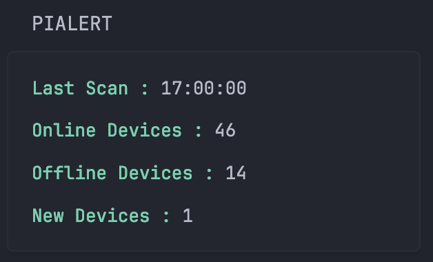
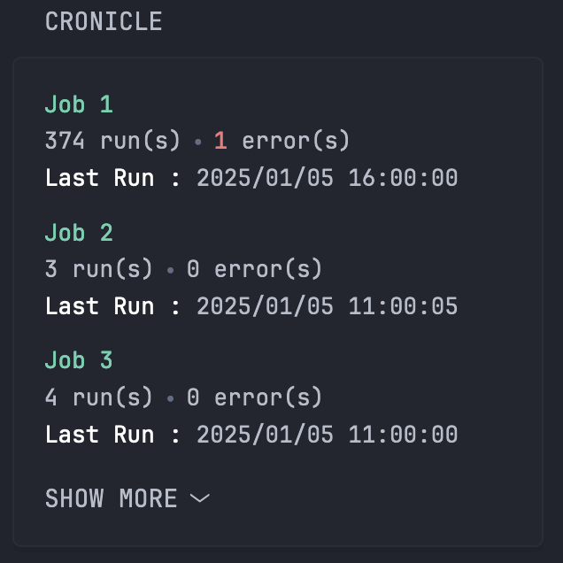
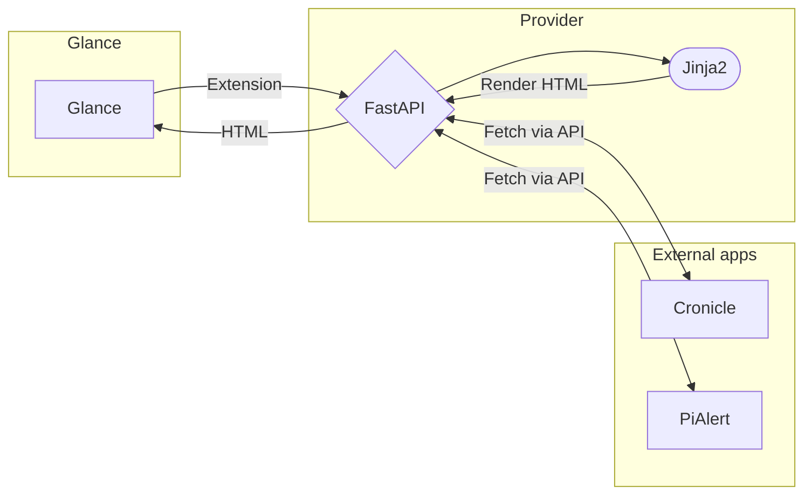

# PiAlert and Cronicle provider for Glance

FastAPI-based service that provides PiAlert and Cronicle monitoring widgets for [Glance](https://github.com/glanceapp/glance).

It uses the ["extensions" feature](https://github.com/glance-hub/glance/blob/main/docs/extensions.md) of Glance to display the information in the dashboard.

## Preview

<p align="center">  
     
</p>

## 🚀 Features

- PiAlert system status monitoring
- Cronicle job history tracking and statistics
- Docker containerization for easy deployment

## 🛠️ Configuration & Installation

Clone the repository:
```bash
git clone https://github.com/wagga40/GlanceProvider.git
cd GlanceProvider
```

Copy the default configuration file and modify it with your settings:

```bash
cp config.yaml.default config.yaml
```

Update the following in your `config.yaml`:
- PiAlert API key and server details (see [PiAlert API usage](https://github.com/leiweibau/Pi.Alert/blob/main/docs/API-USAGE.md))
- Cronicle API key and server details (see [Cronicle API reference](https://github.com/jhuckaby/Cronicle/blob/master/docs/APIReference.md#api-keys))

Start the service with Docker Compose:

```bash
docker-compose up -d
```

Default port is 8000.


## 🔧 Usage

### Glance Dashboard Integration

Add the following to your Glance configuration:

```yaml
# PiAlert Widget
- type: extension
  url: http://provider.ip.address.or.domain:8000/pialert
  cache: 1s
  allow-potentially-dangerous-html: true

# Cronicle Widget
- type: extension
  url: http://provider.ip.address.or.domain:8000/cronicle
  cache: 1s
  allow-potentially-dangerous-html: true
```

## Architecture

This app uses Glance's extension system to display information in the dashboard. It fetches data from Cronicle and PiAlert APIs and converts it to HTML that Glance inserts into the dashboard.



## 📝 Dependencies

- FastAPI >= 0.115.6
- Uvicorn[standard] >= 0.34.0
- Requests >= 2.32.3
- Jinja2 >= 3.1.5
- PyYAML >= 6.0.1
